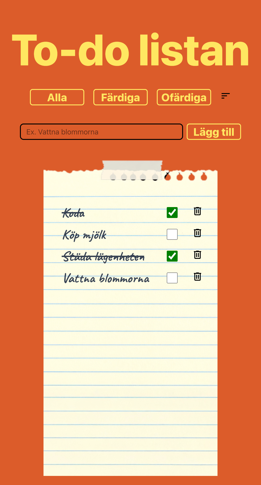
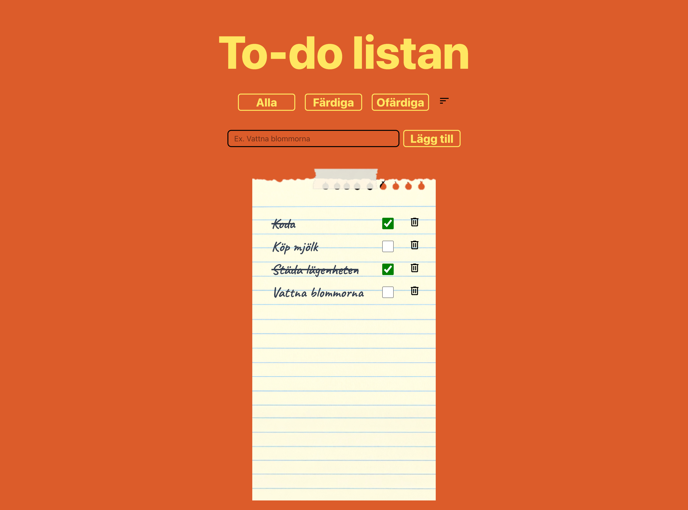

# 📌 Rättningsrapport – fed24d-the-last-todos-AgnesWilson

## 🎯 Uppgiftens Krav:
# Welcome to the Todo List App!

Welcome to this simple yet powerful Todo List app — your go-to place for staying on top of tasks! This project is designed to help users create, manage, and complete their daily tasks in a clean and user-friendly interface.

Users can check off tasks as they finish them, add new ones as they go, and even sort and manage completed items — all with persistent storage so your list stays the same even if you close the tab. Built with component-based architecture and a focus on interactive functionality, this app is a great introduction to state management in modern web development.

---

## Project Overview

This project was developed as part of the **JavaScript Frameworks** course at **Medieinstitutet**. The goal was to build a fully functional Todo List web application while learning essential development concepts such as:

- Component-based architecture in **React**
- State handling and `localStorage`
- Project structure and organization 

---

## Features

- Hardcoded list of todo items
- Todos displayed on screen using HTML structure 
- Completed todos are both visually updated and can be removed from the list via a delete button
- Data persistence using `localStorage`
- Ability to **toggle** completed todos back to incomplete
- A **form** to let users add new todos
- Ability to **sort** todos 

---

**Mobile version**

**Desktop version**

---

## Tech Stack

- HTML5  
- Tailwind
- JavaScript
- React
- Vite  
- Visual Studio Code  
- Git & GitHub  

---

## Installation

To get the project running locally:

1. **Clone the repository**

2. **Install dependencies**
- npm install
- Start the development server
- npm run dev

## This app was created by:

Created by:
[Agnes Wilson](https://github.com/agneswilson) 

Instructor: 
[Sebastian Tegel](https://github.com/sebastiantegel)

## 🔍 ESLint-varningar:

## 🏆 **Betyg: VG**
📌 **Motivering:** Koden uppfyller alla krav och implementerar alla funktioner som specificerats. Den visar en god förståelse för Reacts komponentbaserade arkitektur och hantering av state. Användning av TypeScript och Tailwind visar på avancerad förståelse och ger både typning och styling på ett effektivt sätt. Dessutom är datahantering med hjälp av localStorage väl implementerad för att säkerställa beständighet av todo-listan.

💡 **Förbättringsförslag:**  
Koden är redan välstrukturerad och följer React och general best practices. Eventuella förbättringar kan inkludera: 
1. Bättre hantering av tomma todo-inputs för att förhindra att tomma todos läggs till.
2. Implementera tester för att säkerställa funktionskorrekthet.
3. Använda mer beskrivande namn för state variables för ökad läsbarhet. Exempelvis 'setTodos' kan döpas om till 'updateTodos' för att tydliggöra dess funktion. 
4. Kolla så att CSS och Tailwind-klasser inte är redundanta eller överflödiga. 
5. Förbättra tillgängligheten med attribut som 'aria-label' på fler element och bättre färgkontraster.